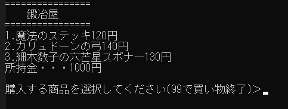
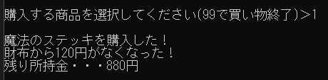
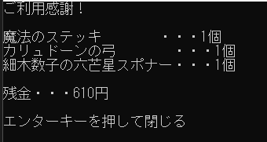
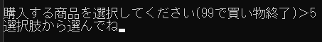
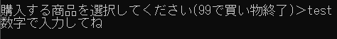
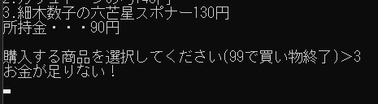

# 買い物コンソールアプリ説明書
## このアプリについて
* 鍛冶屋で任意のアイテムを購入する流れを行えます。
  * 鍛冶屋には複数のアイテムが存在します。
  * 所持金額内で好きなものを購入することが出来ます。
* ### 実際の画面
　

## 購入成功例
* 任意のアイテムのIDを入力することで購入することが出来ます。
  * 購入が完了すると自身のインベントリにアイテムが追加されます。
  
* ### 購入画面
　

 * ### 結果画面
　

## 購入失敗例
* 特定の状況下では正常に購入することが出来ません。
  
 ### 失敗パターン1 : 選択肢以外の数字を入力した場合
　

### 失敗パターン2 : 数字以外の文字列を入力した場合
　

 ### 失敗パターン3 : 所持金額が不足していた場合
　

